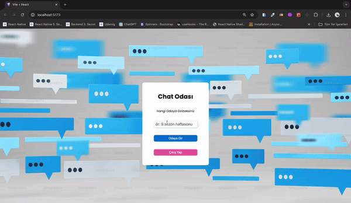

<h1> Firebase_ChatApp </h1>

I developed a chat application using React and Firebase, allowing users to sign in with their Google accounts, switch between rooms, and engage in real-time messaging. The app leverages the powerful integration of React and Firebase to continuously track data and instantly retrieve messages using the onSnapshot method.

<h2> screenshot </h2>

# Firebase_ChatApp
